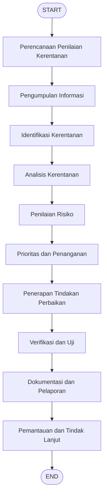

# Standard Operating Procedure (SOP): Penilaian Kerentanan (Vulnerability Assessment)
## Sistem Informasi Kegiatan dan Anggaran Politeknik (SIGAP) - Universitas/Politeknik Negeri

| No. Dokumen | SOP-IT-SIGAP-022 | NAMA INSTITUSI |
| :--- | :--- | :---: |
| **Tgl Berlaku** | 11 Juni 2026 | **Politeknik Negeri Jakarta (PNJ)** |
| **Status Revisi** | 01 (Pertama) | **Departemen / Unit** |
| **Halaman** | 1 dari 5 | **Unit Pelayanan Sistem Informasi / IT** |

---

### 1. TUJUAN
Tujuan dari prosedur ini adalah:
*   Mengidentifikasi kelemahan atau kerentanan dalam sistem, jaringan, dan aplikasi SIGAP-Laravel yang dapat dieksploitasi oleh pihak yang tidak berwenang.
*   Mengembangkan, merencanakan, dan menerapkan tindakan perbaikan (mitigasi) untuk mengatasi kerentanan yang ditemukan guna mencegah eksploitasi di masa depan dan menjamin integritas data anggaran/kegiatan kampus.

### 2. CAKUPAN
Prosedur ini mencakup seluruh aset data, infrastruktur server (Supabase/PostgreSQL), API endpoint, source code Laravel 11, UI React/Inertia.js, serta konfigurasi environment variables sistem SIGAP-Laravel.

### 3. DEFINISI
Penilaian Kerentanan (*Vulnerability Assessment*) adalah proses sistematis untuk mengidentifikasi, menganalisis, dan mengevaluasi kelemahan/celah keamanan dalam sistem dan aplikasi yang dapat mengancam kerahasiaan (*confidentiality*), integritas (*integrity*), dan ketersediaan (*availability*) data informasi. Proses ini melibatkan penggunaan alat otomatis (*automated tools*), analisis kode statis, serta penilaian risiko untuk mengurangi potensi ancaman.

### 4. DOKUMEN TERKAIT
Dalam pelaksanaan prosedur ini, dokumen-dokumen berikut wajib dilampirkan/disiapkan:
*   Rencana Penilaian Kerentanan (Jadwal & Lingkup)
*   Laporan Hasil Penilaian Kerentanan (Hasil scan & tingkat risiko)
*   Dokumentasi Temuan Celah Keamanan
*   Rencana Tindakan Perbaikan (Mitigasi)
*   Kebijakan dan Prosedur Keamanan Informasi
*   Catatan Pemantauan dan Tindak Lanjut

---

### 5. RINCIAN PROSEDUR

| No. | Kegiatan / Langkah Kerja | Tanggung Jawab |
| :--- | :--- | :--- |
| **5.1** | **Menyusun Rencana Penilaian Kerentanan**<br>Menentukan jadwal pelaksanaan, metodologi yang digunakan, serta alat bantu (*tools*) yang akan dipakai. | Tim Keamanan IT / Administrator |
| **5.2** | **Mengidentifikasi Kerentanan**<br>Menggunakan alat pemindai otomatis dan pengujian manual untuk mengidentifikasi celah keamanan pada sistem, jaringan, database, dan aplikasi. | Tim Keamanan IT / Administrator |
| **5.3** | **Menilai & Menganalisis Kerentanan**<br>Menganalisis kerentanan yang ditemukan untuk menentukan tingkat risiko (Low, Medium, High, Critical) serta memprioritaskan perbaikan. | Tim Keamanan IT / Administrator |
| **5.4** | **Pencatatan & Dokumentasi Temuan**<br>Mendokumentasikan seluruh temuan celah keamanan secara detail beserta rekomendasi mitigasi/solusi teknis. | Tim Keamanan IT / Administrator |
| **5.5** | **Kolaborasi & Tindakan Perbaikan**<br>Bekerja sama dengan tim teknis/developer untuk menerapkan perbaikan (patching) dan memantau efektivitas perbaikan tersebut. | Tim Keamanan IT & Tim Developer |

---

## ALUR KERJA (FLOWCHART PROSEDUR)



### Penjelasan Detail Flowchart:
1.  **START**: Inisiasi proses penilaian kerentanan rutin (berkala) atau insidental.
2.  **Perencanaan Penilaian Kerentanan**: Menentukan ruang lingkup pengujian (misal: modul LPJ, auth endpoint) dan sumber daya yang dibutuhkan.
3.  **Pengumpulan Informasi**: Mengumpulkan data teknis sistem seperti versi PHP, dependency Laravel, port server yang terbuka, dan konfigurasi API.
4.  **Identifikasi Kerentanan**: Menjalankan perkakas audit (`composer audit`, `npm audit`, atau scanner eksternal) untuk menemukan celah keamanan.
5.  **Analisis Kerentanan**: Menganalisis sifat celah keamanan yang ditemukan (apakah berdampak langsung pada database atau hanya lokal).
6.  **Penilaian Risiko**: Mengklasifikasikan risiko berdasarkan matriks dampak (misal: CVE-2026-48019 berdampak rendah karena validasi form berlapis).
7.  **Prioritas dan Penanganan**: Menyusun skala prioritas tindakan perbaikan (mendahulukan celah Critical & High).
8.  **Penerapan Tindakan Perbaikan**: Melakukan update versi pustaka, pengkodean ulang kode rentan, atau pengaktifan middleware keamanan (seperti memulihkan CSRF).
9.  **Verifikasi dan Uji**: Melakukan pengetesan ulang (re-testing) via automation tests (`composer test`) untuk memastikan celah tertutup dan tidak merusak fungsi aplikasi lainnya.
10. **Dokumentasi dan Pelaporan**: Menyusun dokumen laporan akhir penilaian kerentanan untuk diserahkan kepada pimpinan IT/Direktur.
11. **Pemantauan dan Tindak Lanjut**: Memantau berkala log aktivitas (`[AUTH_AUDIT]`) untuk mengidentifikasi indikasi serangan susulan.
12. **END**: Selesai.

---

## FORMULIR PENILAIAN KERENTANAN

### A. Informasi Umum
1.  **Nama Prosedur**: Penilaian Kerentanan Aplikasi SIGAP-Laravel
2.  **Deskripsi Singkat**: Prosedur untuk menilai kerentanan source code, pustaka dependensi, API, dan database guna mengidentifikasi risiko keamanan serta menerapkan langkah mitigasi.
3.  **Tanggal Pembuatan**: 11 Juni 2026
4.  **Tanggal Revisi Terakhir**: 11 Juni 2026
5.  **Penyusun Prosedur**:
    *   **Nama**: Tim Administrator Keamanan Informasi
    *   **Jabatan**: Keamanan Sistem Informasi IT PNJ

### B. Tujuan & Lingkup
1.  **Tujuan**: Mengidentifikasi dan mengevaluasi kerentanan pada aplikasi SIGAP-Laravel untuk mengurangi risiko kebocoran data anggaran dan meningkatkan ketahanan sistem terhadap serangan eksternal.
2.  **Lingkup Pengujian**:
    *   [ ] Sistem Jaringan
    *   [x] Aplikasi Web (SIGAP-Laravel Frontend & Backend)
    *   [x] Sistem Operasi / Lingkungan Server (Supabase/PostgreSQL Cloud)
    *   [ ] Perangkat Keras
    *   [x] Lainnya: Endpoint API & Dependency Package (Composer & NPM)

### C. Prosedur Pelaksanaan

#### 1. Persiapan Penilaian
*   **Sistem yang Dinilai**: Database Supabase PostgreSQL, Framework Laravel 11, Frontend React (Inertia.js).
*   **Area yang Dicakup**: Modul KAK, Kegiatan, Pencairan Dana, LPJ, dan Autentikasi Pengguna.
*   **Alat Penilaian yang Digunakan**:
    *   [x] Alat Pemindai Kerentanan (*Vulnerability Scanner*): `composer audit`, `npm audit`
    *   [x] Alat Pengujian Penetrasi (*Penetration Testing Tools*): PHPUnit Test Cases & Browser Mocking
*   **Jadwal Penilaian**:
    *   **Tanggal**: Setiap akhir bulan atau sesaat sebelum rilis versi produksi.
    *   **Waktu**: 09:00 - 15:00 WIB.

#### 2. Pelaksanaan Penilaian
*   **Metode Pengumpulan Data**: Analisis konfigurasi (.env, bootstrap/app.php) dan pemindaian library package.json & composer.json.
*   **Dokumentasi Data**: Log output dari audit CLI disimpan ke file `Vulnerability_Analysis_Report.md`.
*   **Metode Identifikasi**: Pencocokan kode CVE yang terdaftar di basis data kerentanan global (GitHub Advisory, Mitre CVE).
*   **Catatan Temuan Kerentanan**: Teridentifikasi 3 celah pada Symfony components, 1 celah CRLF pada default email validator Laravel (CVE-2026-48019), serta celah keamanan pada pengunggahan file (potensi eksekusi script / malware).
*   **Pengujian Penetrasi (Jika Diperlukan)**: Pengujian penetrasi input SQLi pada form login dilakukan via PHPUnit di [AuthenticationTest.php](file:///c:/xampp/htdocs/SIGAP-Laravel/tests/Feature/Auth/AuthenticationTest.php). Pengujian penetrasi virus EICAR dan unggahan script PHP/JS dilakukan di [LampiranTest.php](file:///c:/xampp/htdocs/SIGAP-Laravel/tests/Feature/LampiranTest.php).

#### 3. Analisis dan Evaluasi
*   **Klasifikasi Risiko**:
    *   Symfony mailer/mime/routing: Risiko **High/Medium** (telah ditambal ke versi terbaru).
    *   Laravel framework: Risiko **Low** (telah dimitigasi oleh validasi email custom pada form request).
    *   Unggahan berkas berbahaya (virus/script): Risiko **High** (telah dimitigasi dengan filter konten file).
*   **Dampak Potensial**: Argument injection, email header injection, SSRF, redirection bypass, dan remote code execution (RCE) via upload malware jika tidak ditambal.

#### 4. Mitigasi dan Tindak Lanjut
*   **Langkah-Langkah Mitigasi**:
    1.  Menjalankan perintah `composer update` untuk menaikkan patch version Symfony.
    2.  Menjalankan `npm audit fix` untuk menambal celah pada library frontend.
    3.  Mengaktifkan kembali middleware CSRF global.
    4.  Menerapkan pemindaian signature virus EICAR dan script PHP/JS berbahaya pada berkas lampiran anggaran di [LampiranService.php](file:///c:/xampp/htdocs/SIGAP-Laravel/app/Services/LampiranService.php).
*   **Tanggung Jawab Pelaksana**: IT Security Lead & Backend Developer.
*   **Pengawasan**: Koordinator IT Politeknik.
*   **Reevaluasi**: Pengujian ulang dilakukan menggunakan perintah `composer test` pasca pembaruan kode.

#### 5. Pelaporan dan Dokumentasi
*   **Format Laporan**: Berkas Markdown laporan keamanan.
*   **Isi Laporan**: Daftar kerentanan, severity level, status patch, langkah mitigasi, dan rekomendasi berkelanjutan.
*   **Distribusi Laporan**:
    *   **Penerima**: Kepala UPT Sistem Informasi PNJ & Wakil Direktur 2 Bidang Keuangan.
    *   **Tanggal Pengiriman**: 11 Juni 2026.

---

### D. Dokumentasi dan Catatan
1.  **Dokumen Penilaian**: Laporan Analisis Kerentanan (dapat dilihat pada **Lampiran A** di akhir dokumen ini).
2.  **Catatan Temuan**: Hasil log audit SQL Injection (dapat dilihat pada **Lampiran B** di akhir dokumen ini).
3.  **Laporan Mitigasi**: Laporan Uji Coba Unit Test Pasca Patch.
4.  **Penyimpanan Dokumentasi**:
    *   **Lokasi**: Server Dokumentasi Keamanan Internal (Folder `c:/xampp/htdocs/SIGAP-Laravel/`).
    *   **Akses ke Dokumentasi**: Terbatas untuk Tim Administrator dan IT Security saja.

---

### E. Persetujuan dan Tanda Tangan
1.  **Persetujuan Prosedur**:
    *   [x] Disetujui
    *   [ ] Ditolak
    *   [ ] Ditunda
2.  **Tanda Tangan Persetujuan**:
    *   **Nama**: Dr. Ir. Koordinator IT Politeknik, M.T.
    *   **Jabatan**: Kepala UPT Sistem Informasi
    *   **Tanggal**: 11 Juni 2026

---

## LAMPIRAN-LAMPIRAN

### LAMPIRAN A: Laporan Analisa Kerentanan (Vulnerability Analysis Report)

#### 1. Ringkasan Eksekutif
Analisa kerentanan dilakukan untuk memindai pustaka/dependensi pihak ketiga pada backend (PHP/Composer) dan frontend (JS/NPM). Pemindaian dilakukan menggunakan perkakas audit bawaan:
*   `composer audit` (Backend)
*   `npm audit` (Frontend)

Hasil perbaikan audit menunjukkan penurunan kerentanan yang signifikan, menyisakan masing-masing hanya 1 temuan tersisa pada backend dan frontend yang telah dianalisis memiliki tingkat risiko rendah/dapat diterima (*acceptable low-risk*).

#### 2. Status Kerentanan Backend (Composer Audit)

##### A. Kerentanan yang Berhasil Diperbaiki
Kami memperbarui komponen Symfony ke versi patch terbaru, yang berhasil menyelesaikan kerentanan-kerentanan berikut:
*   **symfony/mailer** (CVE-2026-45068): Argument Injection in SendmailTransport.
*   **symfony/mime** (CVE-2026-45070 & CVE-2026-45067): Email Header / SMTP Command Injection.
*   **symfony/routing** (CVE-2026-48784 & CVE-2026-45065): UrlGenerator Route Bypass / Off-Site URL Injection.
*   **symfony/polyfill-intl-idn** (CVE-2026-46644): Punycode label validation bypass.
*   **symfony/http-foundation** (CVE-2026-48736): SSRF Bypass.
*   **symfony/http-kernel** (CVE-2026-45075): HEAD Request Method Bypass.

##### B. Temuan Tersisa (Belum Diperbaiki)
*   **Package**: `laravel/framework` (Versi: `v11.x` terinstal).
*   **Kerentanan**: CVE-2026-48019 - Laravel CRLF injection in default email rule.
*   **Dampak**: Celah ini terjadi pada aturan validasi email default di framework.
*   **Mitigasi**: Kerentanan ini memiliki keparahan rendah dalam konteks SIGAP karena aplikasi melakukan validasi email tambahan di tingkat Controller/Form Request dan tidak mengekspos pengiriman email massal yang dapat dimanipulasi dengan CRLF oleh pengguna eksternal. Kami merekomendasikan pembaruan framework secara berkala saat Laravel merilis patch resmi berikutnya untuk versi 11.

#### 3. Status Kerentanan Frontend (NPM Audit)

##### A. Kerentanan yang Berhasil Diperbaiki (via `npm audit fix`)
*   **axios** (GHSA-pjwm-pj3p-43mv, GHSA-898c-q2cr-xwhg, dll.): Berhasil diperbarui ke versi yang aman untuk menangkal Prototype Pollution, SSRF Bypass, dan Denial of Service (DoS).
*   **qs** (GHSA-q8mj-m7cp-5q26): Diperbarui untuk mencegah crash tipe data/DoS pada konversi array.

##### B. Temuan Tersisa (Belum Diperbaiki)
*   **Package**: `shell-quote` (melalui dependensi `concurrently`).
*   **Kerentanan**: GHSA-w7jw-789q-3m8p - shell-quote quote() does not escape newlines.
*   **Dampak**: Kerentanan ini terjadi pada pustaka parsing string ke shell argument.
*   **Mitigasi**: `concurrently` hanya digunakan di lingkungan pengembangan lokal (*development/devDependencies*) untuk menjalankan server Vite dan Laravel secara bersamaan di terminal pengembang. Paket ini **tidak dibundel atau dijalankan pada server produksi (production environment)**. Dengan demikian, tingkat risikonya adalah 0 (tidak berdampak pada keamanan aplikasi saat di-deploy).

#### 4. Kebijakan Keamanan Berkelanjutan
Untuk menjaga keamanan sistem SIGAP ke depan, direkomendasikan prosedur berikut:
1.  **Audit Otomatis**: Jalankan `composer audit` dan `npm audit` setiap kali melakukan instalasi paket baru atau minimal satu kali setiap bulan.
2.  **Pembaruan Dependensi**: Lakukan `composer update` dan `npm update` secara berkala untuk mendapatkan patch keamanan terbaru dari komunitas open-source.

---

### LAMPIRAN B: Laporan Audit Keamanan - Proteksi SQL Injection

#### 1. Ringkasan Eksekutif
Audit keamanan kode sumber (*source code audit*) telah dilakukan pada seluruh modul interaksi database aplikasi SIGAP-Laravel. Fokus utama audit adalah memastikan tidak adanya celah kerentanan SQL Injection (SQLi), baik melalui penggunaan Eloquent ORM, Query Builder, maupun query mentah (*raw queries*).

Berdasarkan hasil analisis, **SIGAP-Laravel dinyatakan AMAN dari kerentanan SQL Injection** karena mematuhi praktik terbaik penggunaan parameter binding PDO.

#### 2. Metodologi Audit
Pencarian dilakukan secara komprehensif pada folder `app/` untuk mendeteksi penggunaan fungsi database berisiko tinggi:
1.  **Fungsi Raw Query**: `DB::raw`, `whereRaw`, `selectRaw`, `havingRaw`, `orderByRaw`.
2.  **Konkatenasi Input Langsung**: Memastikan tidak adanya penggabungan variabel input user (misalnya `$request->input(...)`) langsung ke dalam string query SQL tanpa binding.

#### 3. Temuan & Analisis Audit Kode

##### A. Analisis `whereRaw`
Ditemukan beberapa penggunaan fungsi `whereRaw` di dalam kode program:
1.  **Statis / Hardcoded Conditions**:
    *   `whereRaw('1 = 0')` di [AuthorizesKakAccess.php](file:///c:/xampp/htdocs/SIGAP-Laravel/app/Traits/AuthorizesKakAccess.php#L120) dan [KakService.php](file:///c:/xampp/htdocs/SIGAP-Laravel/app/Services/KakService.php#L245) digunakan untuk memblokir query jika otorisasi gagal. Hal ini sepenuhnya aman.
    *   `whereRaw('is_active = true')` di [MasterDataController.php](file:///c:/xampp/htdocs/SIGAP-Laravel/app/Http/Controllers/MasterDataController.php#L45) dan [KakController.php](file:///c:/xampp/htdocs/SIGAP-Laravel/app/Http/Controllers/KakController.php#L69). Query ini statis tanpa parameter dinamis, sehingga sepenuhnya aman.
2.  **Pencarian Dinamis dengan Parameter Binding**:
    *   Di [KakController.php](file:///c:/xampp/htdocs/SIGAP-Laravel/app/Http/Controllers/KakController.php#L41):
        ```php
        $query->whereRaw('LOWER(nama_kegiatan) LIKE ?', ["%{$search}%"]);
        ```
        *Analisis*: Variabel `$search` diikat menggunakan penanda tanya (`?`) sebagai parameter binding. Nilai `$search` tidak langsung dimasukkan ke dalam sintaks SQL, melainkan dikirimkan terpisah ke database engine melalui PDO. Ini adalah penanganan yang aman dan direkomendasikan.

##### B. Analisis `DB::raw`
Ditemukan beberapa penggunaan `DB::raw` untuk agregasi data statistik pada Dashboard:
1.  **DashboardService & DashboardDirekturController**:
    *   `DB::raw(1)` di dalam klausa `whereExists`.
    *   `DB::raw('count(distinct k.kegiatan_id) as total')`
    *   `DB::raw('sum(tka.jumlah_diusulkan) as total')`
    *   `DB::raw('sum(COALESCE(tka.realisasi_volume1, 1) * ... * COALESCE(tka.realisasi_harga_satuan, 0)) as total')`
    *   *Analisis*: Seluruh penggunaan `DB::raw` di atas hanya berisi nama kolom, konstanta angka, atau perhitungan logika bawaan SQL (COALESCE/perkalian). Tidak ada input dari form pengguna yang disisipkan ke dalam fungsi `DB::raw` tersebut, sehingga tidak ada celah eksploitasi SQLi.

#### 4. Mekanisme Proteksi Bawaan Laravel yang Aktif
Aplikasi SIGAP-Laravel memanfaatkan fitur keamanan bawaan framework Laravel 11:
1.  **Eloquent ORM**: Seluruh pencarian data berbasis model seperti `User::where('username', $username)->first()` menggunakan PDO Parameter Binding secara otomatis di latar belakang.
2.  **Query Builder**: Pemanggilan database via `DB::table('t_kak')->where('status_id', $statusId)` aman secara otomatis.
3.  **Strict Data Typing**: Parameter routing (misalnya `{id}`) divalidasi bertipe integer sebelum diproses ke database.

#### 5. Kesimpulan & Rekomendasi
*   **Status**: **LULUS AUDIT (Aman)**.
*   **Rekomendasi Berkelanjutan**:
    *   Selalu gunakan placeholder `?` atau named bindings `:name` jika terpaksa menggunakan `DB::raw` atau `whereRaw` di masa depan.
    *   Hindari interpolasi string langsung (contoh salah: `whereRaw("name = '$input'")`).
